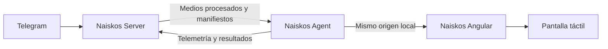

<p align="center">
  
</p>

<h1 align="center">Naiskos</h1>

<p align="center">
  Marco digital privado y autogestionado para Raspberry Pi.
</p>

<p align="center">
  <a href="LICENSE"></a>
  
  
  
</p>

Naiskos presenta fotografías y videos en una pantalla táctil, recibe contenido
mediante Telegram y conserva localmente la última colección válida para seguir
funcionando sin Internet. El servidor central normaliza los medios; un agente
instalado en la Raspberry Pi los sincroniza y sirve la interfaz únicamente por
loopback.

> Este repositorio contiene la interfaz Angular y es la portada pública del
> proyecto. El agente del marco y el servicio central viven en repositorios
> independientes.

## Estado del proyecto

Naiskos está en desarrollo activo y cuenta con un piloto funcional sobre
hardware real. La presentación, la entrega por Telegram, el procesamiento
multimedia, el trabajo offline, la telemetría y las actualizaciones firmadas ya
forman parte del recorrido probado. Todavía no se ofrece como una imagen de
sistema lista para instalar ni como un producto comercial.

## Funciones principales

- Presentación automática de fotografías y reproducción completa de videos.
- Crossfade y encuadre global o individual con `contain`, `cover` e `inherit`.
- Navegación táctil por tap, doble tap, arrastre y deslizamiento horizontal.
- Zoom fotográfico volátil de 1× a 4× mediante pellizco y desplazamiento.
- Controles de reproducción, posición, volumen y mute para videos.
- Galería táctil optimizada con miniaturas, selección múltiple, rotación y
  eliminación.
- Reloj, fecha, clima, métricas de almacenamiento y centro de notificaciones.
- Funcionamiento offline con activación atómica de colecciones completas.
- Configuración persistente que no se sobrescribe al recibir un manifiesto.
- Alta y vinculación mediante QR, salida del kiosco y apagado controlado.

## Cómo funciona



El navegador nunca se conecta directamente a Telegram ni al servicio central.
Tampoco usa la caché del navegador como repositorio multimedia: todo el estado
operativo y los archivos pertenecen al agente local.

## Repositorios

| Repositorio | Responsabilidad |
| --- | --- |
| **[`naiskos-ng`](https://github.com/Rigo85/naiskos-ng)** | Interfaz Angular táctil ejecutada en Chromium en modo kiosco. |
| [`naiskos-agent`](https://github.com/Rigo85/naiskos-agent) | Servicio local: contenido offline, sincronización, configuración, telemetría y control del equipo. |
| [`naiskos-server`](https://github.com/Rigo85/naiskos-server) | API central, bot de Telegram, procesamiento multimedia, manifiestos, notificaciones y actualizaciones. |

El aprovisionamiento reproducible del sistema se mantiene separado de estos
componentes. Los secretos, inventarios productivos y detalles de
infraestructura no forman parte de los repositorios públicos.

## Plataforma de referencia

- Raspberry Pi 4 Model B con 2 GB de RAM.
- Raspberry Pi OS Desktop de 64 bits basado en Debian 13.
- Pantalla táctil SunFounder de 10,1 pulgadas en horizontal, 1280×800.
- Chromium en modo kiosco sobre Wayland/labwc.
- Node.js 24 y npm 11.

El diseño separa la interfaz, el agente y el perfil físico para permitir otros
equipos en el futuro sin asumir que todos los marcos tienen el mismo hardware.

## Este repositorio

`naiskos-ng` contiene la experiencia visual del marco. Está construido con
Angular 22 y se comunica exclusivamente con `naiskos-agent` mediante rutas
relativas del mismo origen.

La aplicación no contiene tokens centrales, no descarga directamente desde
Telegram y no expone las credenciales del dispositivo al navegador.

### Requisitos

- Node.js 24.
- npm 11.
- Para la experiencia completa, `naiskos-agent` en
  `http://127.0.0.1:8080`.

### Instalación y comprobación

```bash
npm ci
npm test -- --watch=false
npm run build
```

El artefacto de producción queda en `dist/naiskos-ng/browser/` y utiliza
nombres con hash. Las fuentes Manrope necesarias para el reloj y el clima se
incluyen localmente junto con su licencia; el visor no depende de una CDN.

| Comando | Función |
| --- | --- |
| `npm start` | Servidor Angular con proxy local hacia el agente. |
| `npm run build` | Compilado optimizado de producción. |
| `npm run watch` | Compilado de desarrollo en observación. |
| `npm test -- --watch=false` | Pruebas unitarias en una sola ejecución. |

### Desarrollo con el agente

En una primera terminal:

```bash
cd ../naiskos-agent
npm ci
npm run build
NAISKOS_DATA_ROOT=./data npm start
```

En otra:

```bash
cd ../naiskos-ng
npm ci
npm start
```

Abre la URL que muestre Angular. `proxy.conf.json` redirige `/api` y `/media`
al agente local; no debe contener credenciales ni direcciones de producción.

Para probar exactamente el mismo origen que se utiliza en el marco:

```bash
npm run build
cd ../naiskos-agent
npm run build
NAISKOS_DATA_ROOT=./data \
NAISKOS_WEB_ROOT=../naiskos-ng/dist/naiskos-ng/browser \
npm start
```

Después abre `http://127.0.0.1:8080/`.

## Arquitectura de la interfaz

- `src/app/core/models.ts`: contrato de manifiesto, ajustes, medios, clima y
  aprovisionamiento.
- `src/app/core/agent-api.ts`: único acceso HTTP; todas las rutas son relativas.
- `pointer-gestures.ts`: clasificación de tap, swipe y gesto descendente.
- `photo-zoom.ts`: matemáticas puras del pellizco y desplazamiento acotado.
- `slideshow-policy.ts`: tiempos y avance de fotografías y videos.
- `media-readiness.ts`: precarga y disponibilidad antes del crossfade.
- `app.ts`, `app.html` y `app.scss`: estado y presentación del kiosco.

Las pruebas cubren navegación, temporizadores, cambios de manifiesto, video,
gestos, zoom y acciones administrativas.

## Contrato con el agente

`AgentApi` usa rutas relativas bajo `/api/v1` para:

- manifiesto, clima y aprovisionamiento;
- consulta, lectura y ocultación de notificaciones;
- actualización o restauración de ajustes;
- encuadre, rotación y eliminación de medios;
- salida de Naiskos y apagado del equipo.

Los archivos se cargan desde `/media`. En producción, Angular y estos endpoints
son servidos por el mismo agente en loopback; no se requiere CORS.

## Despliegue en el marco

1. Ejecuta pruebas y build con la versión de Node indicada.
2. Empaqueta `dist/naiskos-ng/browser` junto con el release compatible del
   agente.
3. Activa ambos de forma atómica; no publiques únicamente el frontend si el
   contrato local cambió.
4. Reinicia el agente después de cambiar el enlace del directorio web.
5. Comprueba en la pantalla real tap, swipe, pellizco, video, audio, modo
   offline y recuperación tras reinicio.

En Wayland/labwc el touchscreen debe usar `mouseEmulation="no"`. Chromium debe
recibir contactos con `pointerType="touch"` e identificadores distintos; si el
compositor los convierte en un único mouse, ninguna biblioteca JavaScript
puede reconstruir correctamente el pellizco.

## Seguridad y privacidad

- No añadas `.env`, tokens, claves, manifiestos reales ni medios al repositorio.
- No conviertas URLs del servicio central en llamadas directas del navegador.
- El texto de remitente es una preferencia global y no debe revelar más datos
  que los incluidos deliberadamente en el manifiesto local.
- La salida y el apagado requieren que el agente valide el origen local y que
  el sistema limite la autorización mediante PolicyKit.

## Licencia

Naiskos Angular se distribuye bajo la
[GNU Affero General Public License v3.0](LICENSE), exclusivamente en su versión
3 (`AGPL-3.0-only`).
